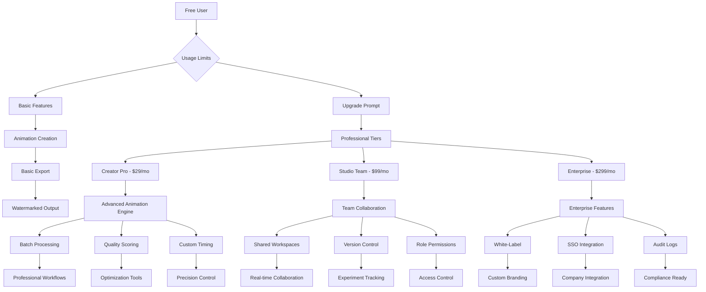
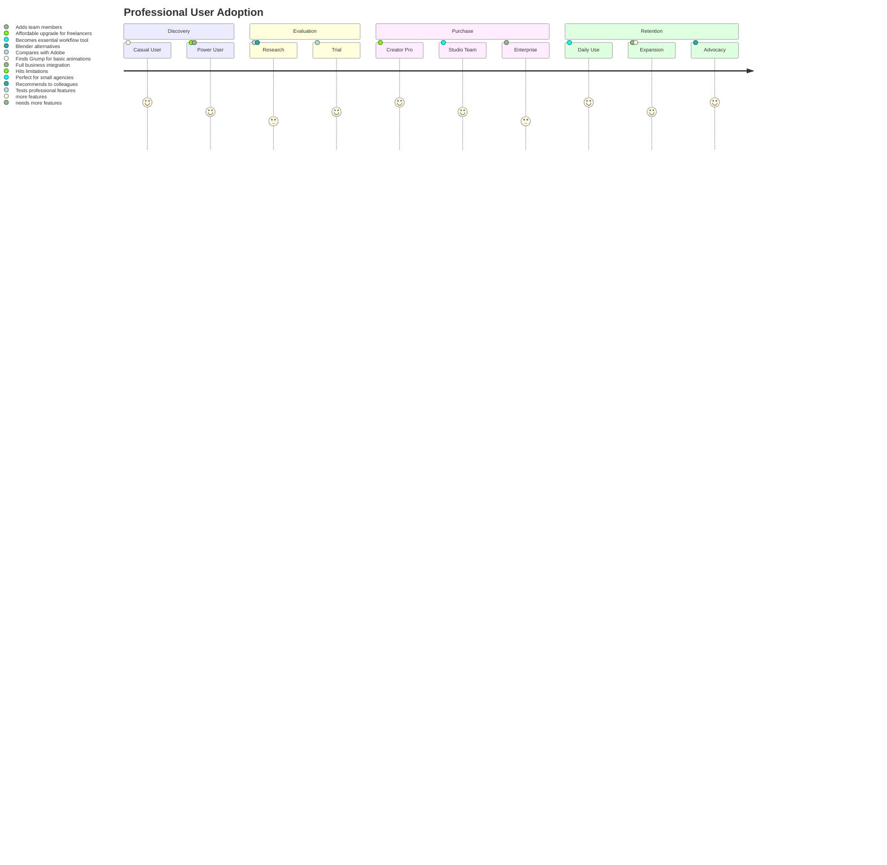

# 🛠️ Grump Professional Tools Architecture



## 🎯 Professional User Journey



## 💰 Revenue Optimization Flow

```mermaid
flowchart LR
    A[Free Users] --> B[Hit Limits]
    B --> C[Upgrade Prompts]
    C --> D[Landing Pages]
    D --> E[Pricing Comparison]
    E --> F[Purchase Decision]

    F --> G[Creator Pro]
    F --> H[Studio Team]
    F --> I[Enterprise]

    G --> J[Feature Usage]
    H --> K[Team Expansion]
    I --> L[Custom Integration]

    J --> M[Upgrade to Team]
    K --> N[Add Enterprise Features]
    L --> O[Consulting Services]

    M --> P[Higher Revenue]
    N --> Q[Enterprise Revenue]
    O --> R[Service Revenue]

    P --> S[Retention]
    Q --> T[Loyalty]
    R --> U[Expansion]